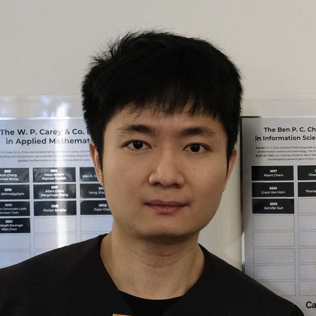
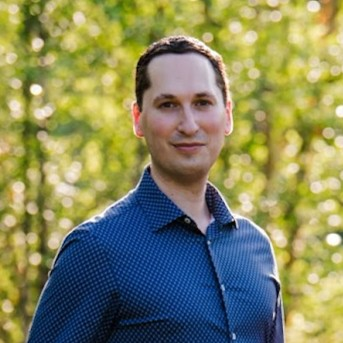
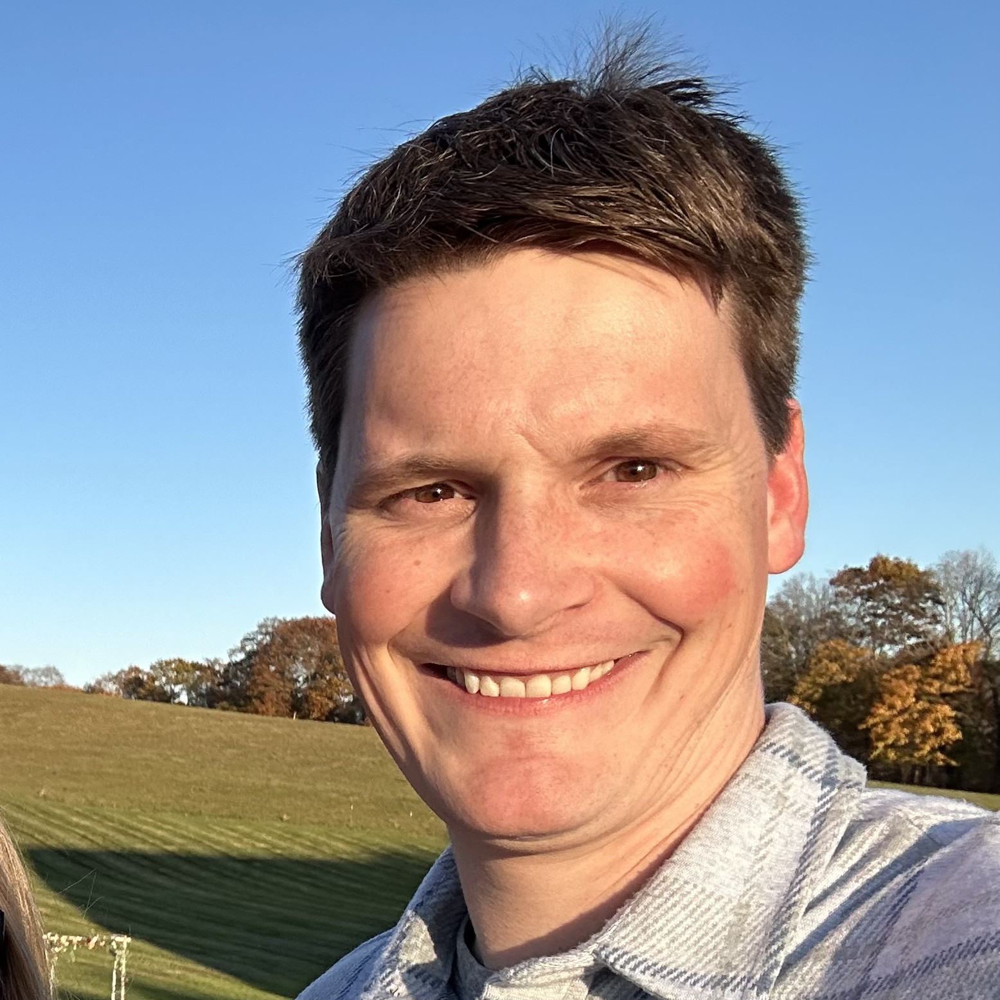
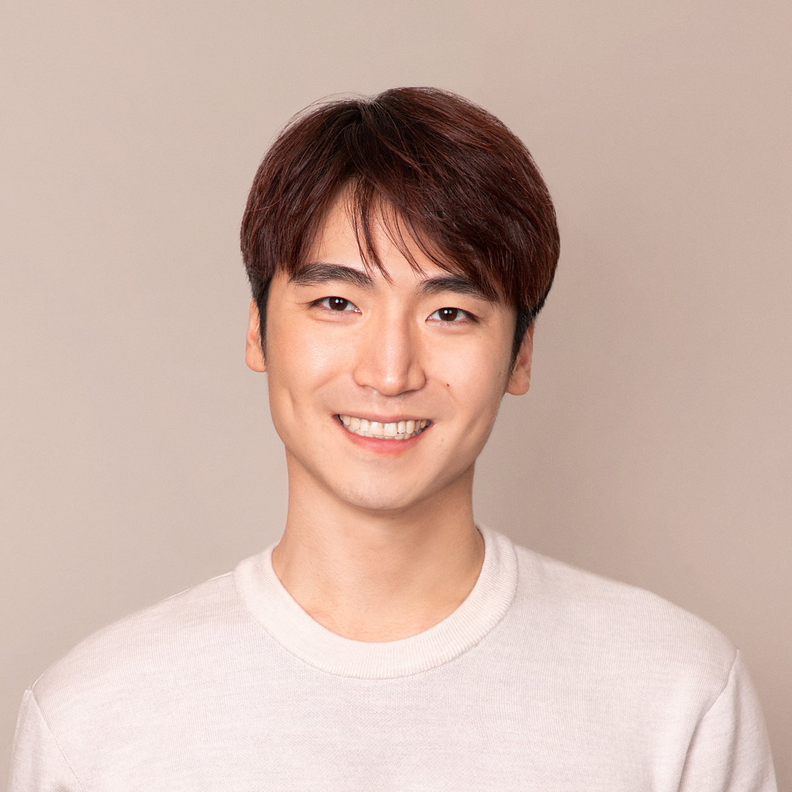
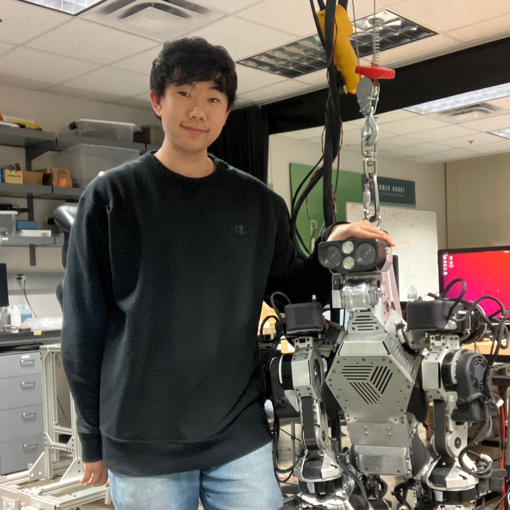
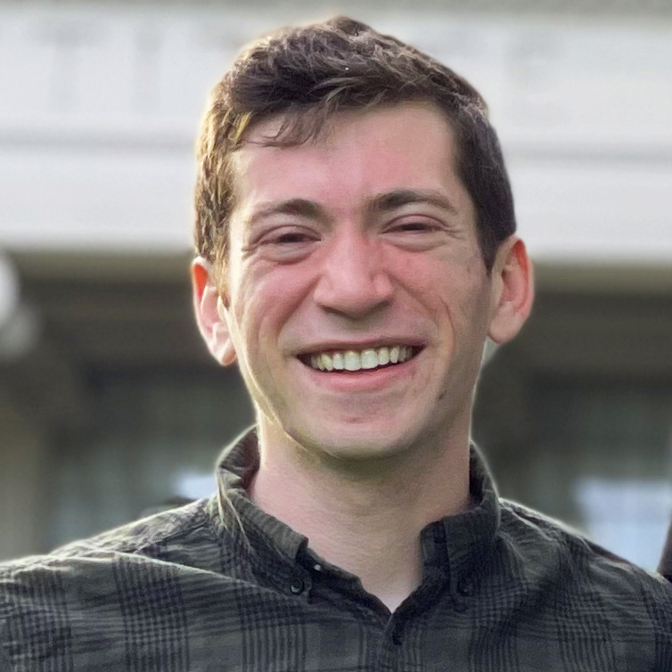
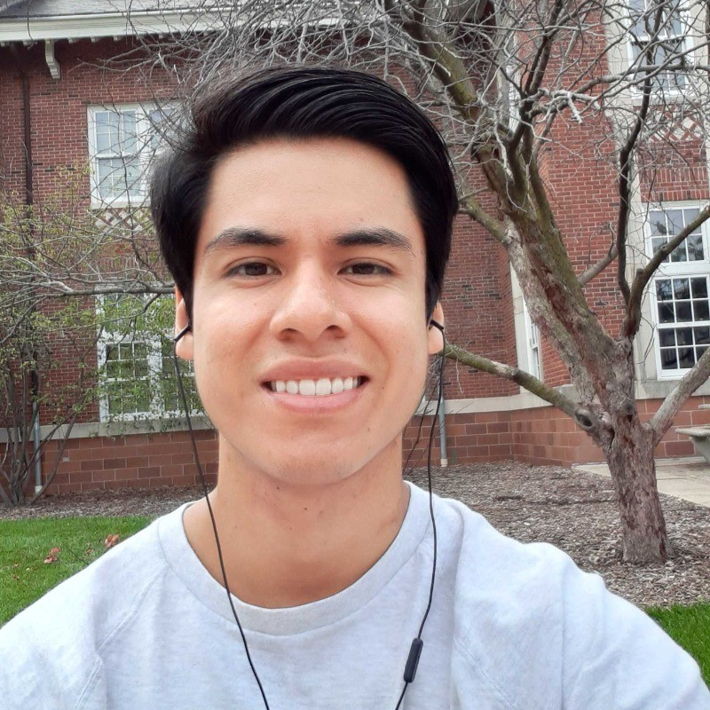
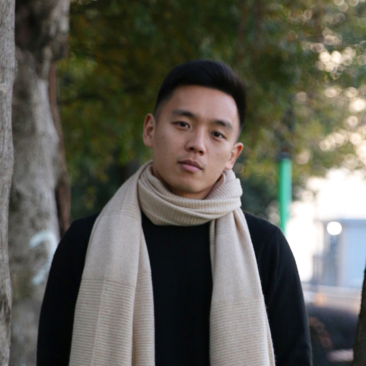
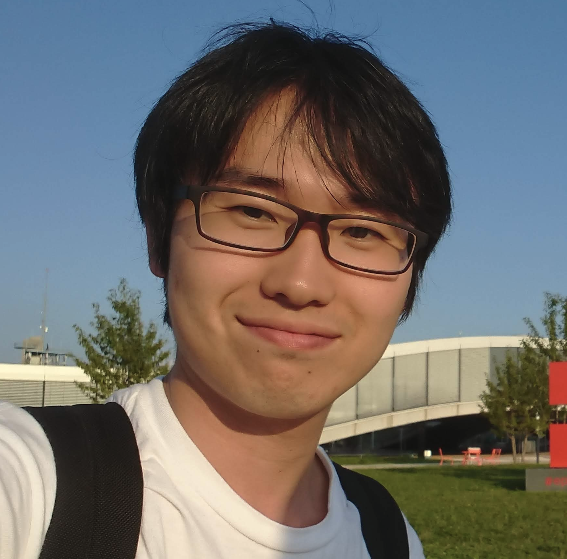
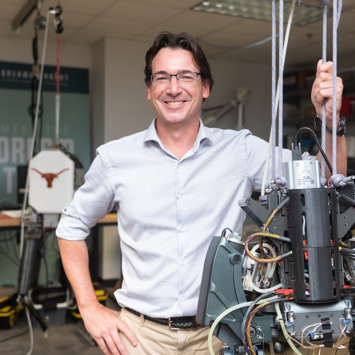

<link media="all" href="./css/glab.css" type="text/css" rel="StyleSheet">

<link rel="preconnect" href="https://fonts.googleapis.com">
<link rel="preconnect" href="https://fonts.gstatic.com" crossorigin>
<link href="https://fonts.googleapis.com/css2?family=Didact+Gothic&family=Open+Sans:ital,wght@0,300..800;1,300..800&display=swap" rel="stylesheet">
<link href="https://fonts.googleapis.com/css2?family=Open+Sans:ital,wght@0,300..800;1,300..800&display=swap" rel="stylesheet">
<link rel="stylesheet" href="https://cdn.jsdelivr.net/gh/jpswalsh/academicons@1/css/academicons.min.css">

<head><meta http-equiv="Content-Type" content="text/html; charset=UTF-8">
  <title>Dexterous Humanoid Manipulation Workshop @ Humanoids 2025</title>

  <meta property="og:title" content="Dexterous Humanoid Manipulation Workshop">
  <meta property="og:description" content="Dexterous Humanoid Manipulation Workshop @ 2025 IEEE-RAS 24th International Conference on Humanoid Robots">
  <meta property="og:image" content="https://raw.githubusercontent.com/dexterous-humanoid-manipulation/dexterous-humanoid-manipulation.github.io/current/src/figure/humanoids2025_logo.png">
  <meta property="og:image:width" content="880">
  <meta property="og:image:height" content="220">
  <meta property="og:url" content="https://dexterous-humanoid-manipulation.github.io/">

<!-- Google tag (gtag.js) -->

</head>

<body data-gr-c-s-loaded="true">

<table align=center width=800px>
  <tr>
    <td>
      

        <h1 align="left">
          <strong>Dexterous Humanoid Manipulation Workshop</strong>
        </h1>
        <h3> <a href="https://2025humanoids.org/"><b>2025 IEEE-RAS 24th International Conference on Humanoid Robots</b></a></h3>
        <h3>October 2, 2025 | COEX, Seoul, Korea | Room #211</h3>
        <h3>Streaming: <a href="https://t.co/3oZHMm3XHl">https://t.co/3oZHMm3XHl</a></h3>
      

    </td>
  </tr>
</table>

<table align=center width=800px>
  <tr>
    <td>
      <!-- <a href="#submission" style="color:#484824;">
        Paper Submission
      </a>
      &nbsp;&nbsp;&nbsp;&nbsp; -->
      <a href="#program" style="color:#484824;">
        Program Schedule
      </a>
      &nbsp;&nbsp;&nbsp;&nbsp;
      <a href="#submission" style="color:#484824;">
        Contributed Papers
      </a>
      &nbsp;&nbsp;&nbsp;&nbsp;
      <a href="#speakers" style="color:#484824;">
        Invited Speakers
      </a>
      &nbsp;&nbsp;&nbsp;&nbsp;
      <a href="#organizers" style="color:#484824;">
        Organizers
      </a>
    </td>
  </tr>
</table>

<table align=center width=800px>
  <tr>
    <td>
      <h2 id="overview">Overview</h2>
    </td>
  </tr>
  <tr>
    <td>
      

        Humanoid robotics has advanced rapidly in recent years. While research primarily focused on agile motion using model-based whole-body control and reinforcement learning, the true advantage of humanoids lies in their human-like morphology. This allows them to perform tasks autonomously in environments designed for humans, making them uniquely suited for supporting human activities. To fully realize this potential, dexterous manipulation is essential. Although hardware design, control
        strategies, and high-level decision-making have each advanced substantially within their respective domains, these components remain inherently interdependent. For example, robust hardware and control algorithms are essential for effective autonomy, while high-level decision-making requirements often drive hardware and controller design. Nevertheless, collaboration across these areas remains limited, largely because of divergent technical focuses and expertise.  
        Therefore, this workshop aims to bridge these communities by exploring synergies across robot hardware, control algorithms, and high-level autonomy, with an emphasis on enabling dexterous manipulation for humanoid upper bodies. We are particularly interested in hardware designs that support versatile manipulation, control strategies for stable and contact-rich interaction, and learning-based frameworks for developing cost-effective autonomous systems. Topics of discussion will include dexterous hand design, tactile sensing, whole-body planning and control, and learning approaches for skill acquisition and deployment. We invite researchers from both academia and industry to contribute their perspectives. By bringing together diverse expertise, we aim to catalyze collaboration and accelerate progress toward autonomous, dexterous humanoid systems.
      

    </td>
  </tr>
</table>

<table align=center width=800px>
<tr>
  <td>
    <h2 id="program">Program Schedule</h2>
  </td>
</tr>
<tr>
  <td>
<table class="program_table">
  <tbody>
    <tr class="hard_topline">
      <td>9:00 - 9:10</td>
      <td>Opening</td>
      <td></td>
    </tr>
    <tr>
      <td>9:10 - 9:45</td>
      <td>
      <i>Perioperation: Sensoring Human Manipulation for Dexterous Humanoid Manipulation</i>
      </td>
      <td>Hao-Shu Fang</td>
    </tr>
    <tr>
      <td>9:45 - 10:20</td>
      <td>
      <i>Robotic Avatar System for Dexterous Manipulation and Learning</i>
      </td>
      <td>Jaeheung Park</td>
    </tr>
    <tr class="hard_bottomline">
      <td>10:20 - 10:40</td>
      <td>
        Presentations of Contributed Papers 
        <detail><i>SLAC: Simulation-Pretrained Latent Action Space for Whole-Body Real-World RL</i></detail> 
        <detail><i>Enhancing Tactile-based Reinforcement Learning for Robotic Control</i></detail>
      </td>
      <td>
         
        <detail>Jiaheng Hu</detail> 
        <detail>Elle Miller</detail>
      </td>
    </tr>
    <tr class="hard_bottomline">
      <td>10:40 - 11:10</td>
      <td>Coffee Break and Poster Session</td>
      <td></td>
    </tr>
    <tr>
      <td>11:10 - 11:45</td>
      <td>
      <i>Real2Sim2Real Learning for Humanoid Dexterous Loco-Manipulation and Manipulation Skills</i>
      </td>
      <td>Guanya Shi</td>
    </tr>
    <tr class="hard_bottomline">
      <td>11:45 - 12:20</td>
      <td>
      <i>Impact Analysis for Whole Body Manipulation Tasks with Controlled Contact Transitions</i>
      </td>
      <td>Christian Ott</td>
    </tr>
    <tr class="hard_bottomline">
      <td>12:20 - 13:25</td>
      <td>Lunch Break and Demos</td>
      <td>RobotEra</td>
    </tr>
    <tr>
      <td>13:25 - 14:00</td>
      <td>
      <i>Manipulation != Locomotion, So How Do We Achieve Locomanipulation?</i>
      </td>
      <td>Jonathan Hurst</td>
    </tr>
    <tr>
      <td>14:00 - 14:35</td>
      <td>
      <i>Large Behavior Models for Robot Manipulation: What Works and What Matters</i>
      </td>
      <td>Benjamin Burchfiel</td>
    </tr>
    <tr class="hard_bottomline">
      <td>14:35 - 15:10</td>
      <td>
      <i>Developing Large Behavior Models on Atlas</i>
      </td>
      <td>Pat Marion</td>
    </tr>
    <tr class="hard_bottomline">
      <td>15:10 - 15:40</td>
      <td>Coffee Break and Poster Session</td>
      <td></td>
    </tr>
    <tr>
      <td>15:40 - 16:00</td>
      <td>Presentations of Contributed Papers 
        <detail><i>RAMBO: RL-augmented Model-based Whole-body Control for Loco-manipulation</i></detail> 
        <detail><i>Few-Shot Learning of Tool-Use Skills with Proximity and Tactile Sensing</i></detail>
      </td>
      <td>
         
        <detail>Jin Cheng</detail> 
        <detail>Marina Y. Aoyama</detail>
      </td>
    </tr>
    <tr>
      <td>16:00 - 16:50</td>
      <td>Panel Discussion</td>
      <td>Luis Sentis Jonathan Hurst Benjamin Burchfiel Pat Marion</td>
    </tr>
    <tr class="hard_bottomline">
      <td>16:50 - 17:00</td>
      <td>Closing</td>
      <td></td>
    </tr>
  </tbody>
</table>
  </td>
</tr>
</table>

<table align=center width=800px>
<tr>
  <td>
    <h2 id="submission">Contributed Papers</h2>
    <!-- <h2 id="submission">Paper Submission Guidelines</h2> -->
  </td>
</tr>
<tr>
  <td>
    

      We invite workshop paper submissions related to the following topics:
    

  </td>
</tr>
<tr>
  <td>
    <table align=left style="margin-top:12px; margin-bottom:12px;">
    <tr>
      <td>&nbsp;&nbsp;&nbsp;&nbsp;<highlight>Dexterous Hardware</highlight>
        <ul style="margin: 0;">
          <li>Advanced grippers and multi-fingered hands</li>
          <li>Tactile sensors</li>
          <li>Novel mechanisms enabling dexterity</li>
          <li>New humanoid designs focused on manipulation</li>
        </ul>
      </td>
    </tr>
    <tr>
      <td>&nbsp;&nbsp;&nbsp;&nbsp;<highlight>Advanced Control Algorithms</highlight>
        <ul style="margin: 0;">
          <li>Whole-body control and planning architectures</li>
          <li>Contact-rich manipulation</li>
          <li>Novel dexterous behaviors</li>
        </ul>
      </td>
    </tr>
    <tr>
      <td>&nbsp;&nbsp;&nbsp;&nbsp;<highlight>Autonomous and Shared-Autonomy Systems</highlight>
        <ul style="margin: 0;">
          <li>Learning frameworks for dexterous manipulation</li>
          <li>Datasets for dexterous manipulation</li>
          <li>Learning for loco-manipulation</li>
          <li>Novel interfaces for teaching manipulation skills</li>
        </ul>
      </td>
    </tr>
    </table>
  </td>
</tr>
<!-- <tr>
  <td>
    

      Submissions should be up to 4 pages, with unlimited references and appendices, and formatted in the <a href="https://ras.papercept.net/conferences/support/support.php">IEEE conference style</a> (ICRA or Humanoids). Anonymization is not required. Work under review or accepted at other workshops or conferences is welcome, as we do not require copyright transfer. We are accepting submissions through <a href="https://openreview.net/group?id=IEEE.org/RAS/Humanoids/2025/Workshop/DHM"><b>OpenReview</b></a>.
    

  </td>
</tr> -->
<!-- <tr>
  <td>
    <table align=left style="margin-top:12px; margin-bottom:12px;">
    <tr>
      <td>&nbsp;&nbsp;&nbsp;&nbsp;<highlight>Paper Submission Due</highlight></td> <td><s>September 18, 2025 11:59 PM (AOE)</s></td>
    </tr>
    <tr>
      <td>&nbsp;&nbsp;&nbsp;&nbsp;<highlight>Camera-Ready Papers Due</highlight></td> <td><s>September 27, 2025 11:59 PM (AOE)</s></td>
    </tr>
    <tr>
      <td>&nbsp;&nbsp;&nbsp;&nbsp;<highlight>Workshop</highlight></td> <td>October 2, 2025 (Korea Time)</td>
    </tr>
    </table>
  </td>
</tr> -->
<!-- <tr>
  <td>
    

       We have set the submission deadline for September 18; however, submissions will be reviewed on a <b>rolling basis</b>, and authors will receive notifications approximately one to two weeks after submission. We strongly encourage <b>early submission</b>, especially for those who may need early notification for travel, visa, or funding arrangements.
    

  </td>
</tr> -->
<tr>
  <td>
<table class="paper_table">
  <tbody>
    <tr class="hard_topline">
      <td>
        Accepted Papers
      </td>
    </tr>
    <tr class="hard_topline">
      <td>
        <i>SLAC: Simulation-Pretrained Latent Action Space for Whole-Body Real-World RL</i> 
        <detail>Jiaheng Hu, Peter Stone, Roberto Martín-Martín</detail> 
        <detail><a href="src/file/paper/jhu.pdf">Paper</a> | <a href="src/file/poster/jhu.pdf">Poster</a> | <spotlight>Spotlight Presentation</spotlight></detail>
      </td>
    </tr>
    <tr>
      <td>
        <i>Towards Developing Standards and Guidelines for Robot Grasping and Manipulation Pipelines</i> 
        <detail>Adam Norton</detail> 
        <detail><a href="src/file/poster/anorton.pdf">Poster</a></detail>
      </td>
    </tr>
    <tr>
      <td>
        <i>Enhancing Tactile-based Reinforcement Learning for Robotic Control</i> 
        <detail>Elle Miller, Trevor McInroe, David Abel, Oisin Mac Aodha, Sethu Vijayakumar</detail> 
        <detail><a href="src/file/paper/emiller.pdf">Paper</a> | <a href="src/file/poster/emiller.pdf">Poster</a> | <spotlight>Spotlight Presentation</spotlight></detail>
      </td>
    </tr>
    <tr>
      <td>
        <i>DexRefine: Refine Human Motion to Physically Feasible Robotic Actions</i> 
        <detail>Hyesung Lee, Si-Hwan Heo, Sungwook Yang</detail> 
        <detail><a href="src/file/paper/hlee.pdf">Paper</a> | <a href="src/file/poster/hlee.pdf">Poster</a></detail>
      </td>
    </tr>
    <tr>
      <td>
        <i>Action Chunking Proximal Policy Optimization for Universal Dexterous Grasping</i> 
        <detail>Sanghyun Hahn, Jonghyun Choi</detail> 
        <detail><a href="src/file/paper/shahn.pdf">Paper</a> | <a href="src/file/poster/shahn.pdf">Poster</a></detail>
      </td>
    </tr>  
    <tr>
      <td>
        <i>Tac2Motion: Contact-Aware Reinforcement Learning with Tactile Feedback for Robotic Hand Manipulation</i> 
        <detail>Yitaek Kim, Casper Hewson Rask, Christoffer Sloth</detail> 
        <detail><a href="src/file/paper/ykim.pdf">Paper</a> | <a href="src/file/poster/ykim.pdf">Poster</a></detail>
      </td>
    </tr>  
    <tr>
      <td>
        <i>RAMBO: RL-augmented Model-based Whole-body Control for Loco-manipulation</i> 
        <detail>Jin Cheng, Dongho Kang, Gabriele Fadini, Guanya Shi, Stelian Coros</detail> 
        <detail><a href="src/file/paper/jcheng.pdf">Paper</a> | <a href="src/file/poster/jcheng.pdf">Poster</a> | <spotlight>Spotlight Presentation</spotlight></detail>
      </td>
    </tr>
    <tr>
      <td>
        <i>Multi-contact Optimization for Whole-body Dexterity</i> 
        <detail>Victor Leve, Joao Moura, Sachiya Fujita, Tamon Miyake, Steve Tonneau Tonneau, Sethu Vijayakumar</detail> 
        <detail><a href="src/file/paper/vleve.pdf">Paper</a> | <a href="src/file/poster/vleve.pdf">Poster</a></detail>
      </td>
    </tr>
    <tr>
      <td>
        <i>Few-Shot Learning of Tool-Use Skills with Proximity and Tactile Sensing</i> 
        <detail>Marina Y. Aoyama, Sethu Vijayakumar, Tetsuya Narita</detail> 
        <detail><a href="src/file/paper/maoyama.pdf">Paper</a> | <a href="src/file/poster/maoyama.pdf">Poster</a> | <spotlight>Spotlight Presentation</spotlight></detail>
      </td>
    </tr>  
    <tr class="hard_bottomline">
      <td>
        <i>Real-Time Multimodal Tactile Sensor with Visual and Auditory Feedback</i> 
        <detail>Hyosung Kim, Junhui Lee, Saekwang Nam</detail> 
        <detail><a href="src/file/paper/hkim.pdf">Paper</a> | <a href="src/file/poster/hkim.pdf">Poster</a></detail>
      </td>
    </tr>
  </tbody>
</table>    
  </td>
</tr>
</table>

<table align=center width=800px>
  <tr>
    <td> 
      <h2 id="speakers">Invited Speakers</h2>
    </td>
  </tr>
  <tr>
    <td> 
<table>
  <tr valign=top>
    <td width=150px> 
      
      

      <a href="https://fang-haoshu.github.io">Hao-Shu Fang</a> 
      UMD 
      

    </td>
    <td width=150px> 
      
      

      <a href="http://dyros.snu.ac.kr/team/jaeheung-park">Jaeheung Park</a> 
      Seoul National University 
      

    </td>
    <td width=150px> 
      
      

      <a href="https://www.gshi.me">Guanya Shi</a> 
      CMU
      

    </td>
    <td width=150px> 
      
      

      <a href="https://www.acin.tuwien.ac.at/en/staff/cott/">Christian Ott</a> 
      TU Wien, DLR 
      

    </td>
    <td width=150px> 
      
      

      <a href="https://mime.engineering.oregonstate.edu/research/drl">Jonathan Hurst</a> 
      Oregon State, 
      Agility Robotics
      

    </td>
  </tr>
  <tr>
    <td>
      

    </td>
  </tr>
  <tr valign=top>
    <td width=150px> 
      
      

      <a href="https://www.linkedin.com/in/benburchfiel">Benjamin Burchfiel</a> 
      TRI 
      

    </td>
    <td width=150px> 
      
      

      <a href="http://bostondynamics.com/atlas">Pat Marion</a> 
      Boston Dynamics
      

    </td>
  </tr>
</table>
    </td>
  </tr>
</table>

<table align=center width=800px>
  <tr>
    <td> 
      <h2 id="organizers">Organizers</h2>
    </td>
  </tr>
  <tr>
    <td> 
<table>
  <tr valign=top>
    <td width=150px> 
      
      

      <a href="https://mingyoseo.com">Mingyo Seo</a> 
      UT Austin
      

    </td>
    <td width=150px> 
      
      

      <a href="https://dokkev.github.io/">Dongho Kang</a> 
      UT Austin
      

    </td>
    <td width=150px> 
      
      

      <a href="https://gmargo11.github.io">Gabriel Margolis</a> 
      MIT
      

    </td>
    <td width=150px> 
      
      

      <a href="https://younghyopark.me">Younghyo Park</a> 
      MIT
      

    </td>
    <td width=150px> 
      
      

      <a href="https://www.linkedin.com/in/guillermo-colin-navarro-71905863">Guillermo Colin</a> 
      UIUC
      

    </td>
  </tr>
  <tr>
    <td>
      

    </td>
  </tr>
  <tr valign=top>
    <td width=150px> 
      
      

      <a href="https://yuanshenli.com">Shenli Yuan</a> 
      RAI Institute
      

    </td>
    <td width=150px> 
      
      

      <a href="https://haraduka.github.io">Kento Kawaharazuka</a> 
      U Tokyo
      

    </td>
    <td width=150px> 
      
      

      <a href="https://sites.utexas.edu/hcrl/">Luis Sentis</a> 
      UT Austin, 
      Apptronik
      

    </td>
  </tr>
</table>
    </td>
  </tr>
</table>

<table align=center width=800px>
  <tr>
    <td> 
      <h2>Contact</h2>
    </td>
  </tr>
  <tr>
    <td> 
      For any questions, please email <a href="mailto:mingyo@utexas.edu"><highlight>mingyo@utexas.edu</highlight></a>.
    </td>
  </tr>
</table>

